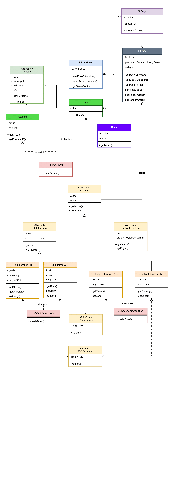

# Библиотечный учёт

## Описание

Приложение "Библиотечный учёт" предназначено для управления библиотечным фондом колледжа. Оно позволяет отслеживать книги, выданные студентам и преподавателям, а также просматривать подробную информацию о каждом пользователе и книгах, которые у них на руках.

## Функциональные возможности

- Отображение списка студентов и преподавателей, зарегистрированных в библиотеке
- Просмотр детальной информации о каждом пользователе, включая книги, которые у них на руках
- Удаление книг из читательского билета
- Автоматическое обновление информации о пользователях и книгах

## Требования

- JDK 20 или более поздняя версия

## Запуск

1. Установите JDK 20 или более позднюю версию, если она не установлена.
2. Скачайте и распакуйте проект "Библиотечный учёт".
3. Запустите программу, используя команду `java -jar library_management.jar`.

## Использование

1. Запустите приложение.
2. В главном окне вы увидите дерево пользователей, разделённых на студентов и преподавателей.
3. Дважды щёлкните по пользователю, чтобы открыть окно с его читательским билетом.
4. В окне читательского билета можно просмотреть список книг, которые находятся у пользователя, и подробную информацию о каждой книге.
5. Для возврата книги выберите её в списке и нажмите кнопку "Удалить".

## Схема проекта (UML)

